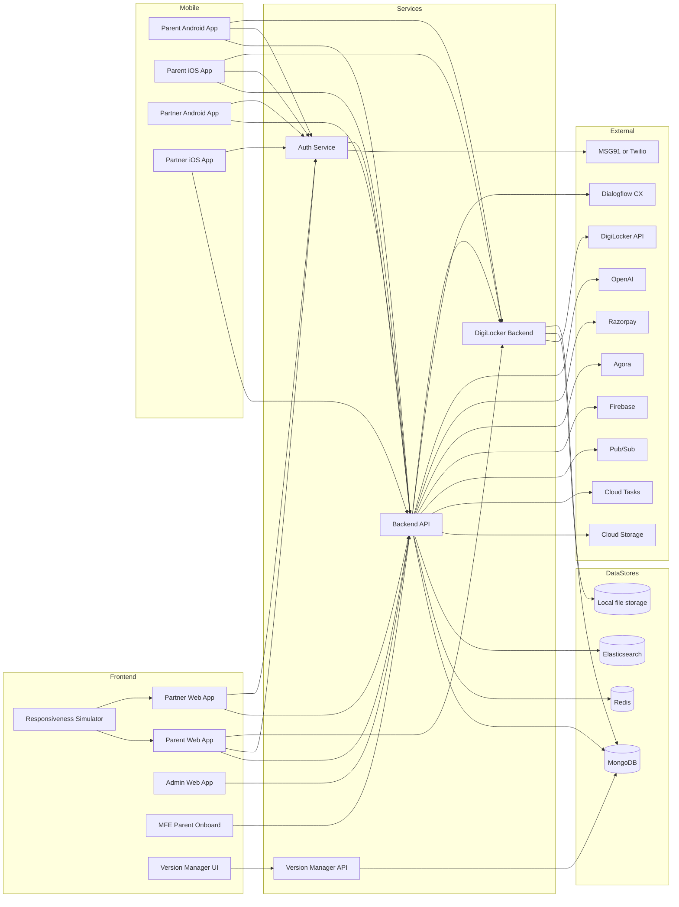

# Architecture Overview

## Scope
Petyosa runs a set of web apps and mobile builds that rely on a shared platform: Auth for OTP, Backend for core APIs and realtime, digiBAckend for DigiLocker KYC, and Version Manager for release metadata.

## Required repos (core)
- `Auth/` OTP auth service (token handoff to Backend).
- `Backend/` core APIs, realtime, admin endpoints, integrations.
- `digiBAckend/` DigiLocker OAuth + KYC retrieval/storage.
- `Frontend/parent` Parent web app (also source for mobile builds via Capacitor).
- `Frontend/partner` Partner web app (also source for mobile builds via Capacitor).
- `Frontend/pet-admin` Admin web app.
- `Frontend/parent-onboard` Parent onboarding micro-frontend (MFE).
- `Frontend/version-manager` Version manager UI.
- `Frontend/responsiveness-simulator` QA tool for layout checks.
- `Android/` native build artifacts and packaging.

## Apps
### Web
- Parent app: `app.petyosa.com`
- Partner app: `partnerapp.petyosa.com`
- Admin app: `admin.petyosa.com`
- Parent onboarding MFE: `app.petyosa.com/onboard`
- Version Manager UI: `versions.petyosa.com`

### Mobile
- Parent Android + iOS builds (Capacitor branches in `Frontend/parent`).
- Partner Android + iOS builds (Capacitor branches in `Frontend/partner`).

## Services
- Auth service: OTP creation/verification and Backend token exchange.
- Backend API: core domain APIs, realtime, admin, integrations.
- DigiLocker backend: OAuth and KYC payload store.
- Version Manager API: release metadata (Mongo-backed).

## Data stores and externals
- Data: MongoDB, Redis, Elasticsearch, local file storage, GCS.
- External: SMS (MSG91/Twilio), DigiLocker, Firebase, Agora, Razorpay, OpenAI, Dialogflow, GCP Tasks, Pub/Sub.

## System map

## Interconnection summary
- Web and mobile apps call Backend for REST and Socket.IO, and Auth for OTP flows.
- Parent app (and its mobile builds) call DigiLocker backend for KYC onboarding.
- Auth service exchanges verified OTP with Backend token endpoint.
- Backend reads DigiLocker KYC from digiBAckend.
- Version Manager stores app release metadata in MongoDB.

## Related flowcharts
- See `architecture/flowcharts` for OTP, DigiLocker, and MFE token flows.

## Environment URLs
| Service | Prod | Dev | Notes |
| --- | --- | --- | --- |
| Backend API | `https://backend.petyosa.com` | `https://devbackend.petyosa.com` | REST under `/api/v1` |
| Auth service | `https://auth.petyosa.com` | `https://devauth.petyosa.com` | OTP gateway |
| DigiLocker backend | `https://devdigibackend.petyosa.com` | `https://devdigibackend.petyosa.com` | Same for prod and dev |
| Version Manager | `https://versions.petyosa.com` | `https://versions.petyosa.com` | Same for prod and dev |
| Parent app | `https://app.petyosa.com` | `https://devapp.petyosa.com` | Web app |
| Partner app | `https://partnerapp.petyosa.com` | `https://devpartnerapp.petyosa.com` | Web app |
| Admin app | `https://admin.petyosa.com` | `https://devadmin.petyosa.com` | Web app |
| Parent-onboard MFE | `https://app.petyosa.com/onboard` | `https://devapp.petyosa.com/onboard` | Embedded MFE |
