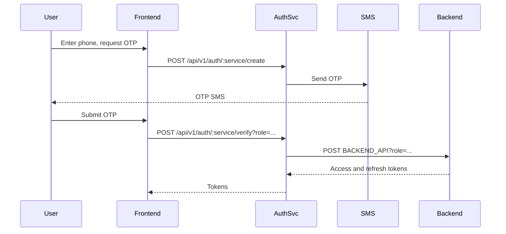
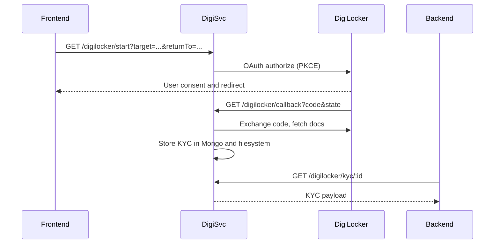
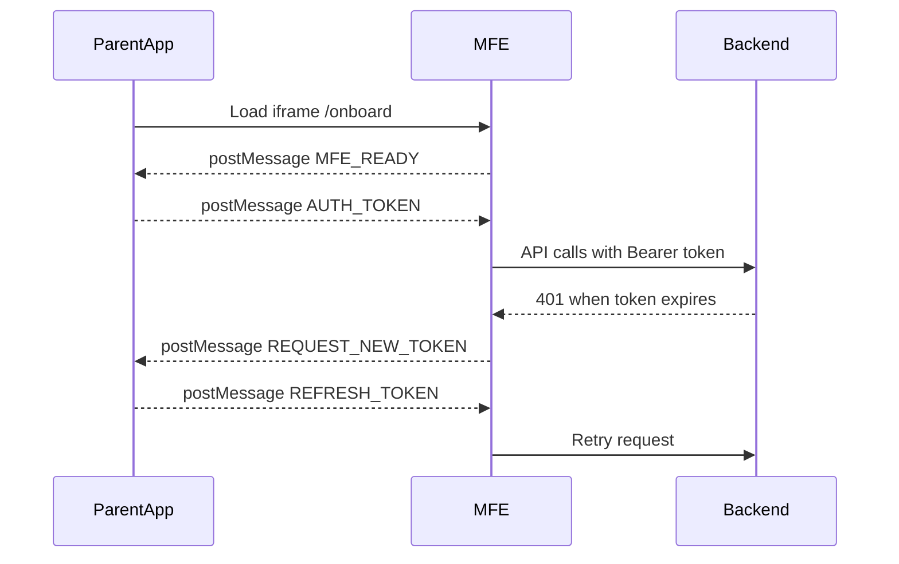

# Flowcharts

## OTP Auth (Auth service to Backend tokens)

## DigiLocker KYC (digiBAckend)

## Parent Onboard MFE token handshake

## Environment URLs (reference)
| Service | Prod | Dev | Notes |
| --- | --- | --- | --- |
| Backend API | `https://backend.petyosa.com` | `https://devbackend.petyosa.com` | REST under `/api/v1` |
| Auth service | `https://auth.petyosa.com` | `https://devauth.petyosa.com` | OTP gateway |
| DigiLocker backend | `https://devdigibackend.petyosa.com` | `https://devdigibackend.petyosa.com` | Same for prod and dev |
| Version Manager | `https://versions.petyosa.com` | `https://versions.petyosa.com` | Same for prod and dev |
| Parent app origin | `https://app.petyosa.com` | `https://devapp.petyosa.com` | Web app |
| Partner app origin | `https://partnerapp.petyosa.com` | `https://devpartnerapp.petyosa.com` | Web app |
| Admin app origin | `https://admin.petyosa.com` | `https://devadmin.petyosa.com` | Web app |
| Parent-onboard MFE | `https://app.petyosa.com/onboard` | `https://devapp.petyosa.com/onboard` | Embedded MFE |
